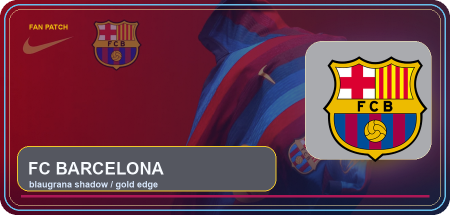
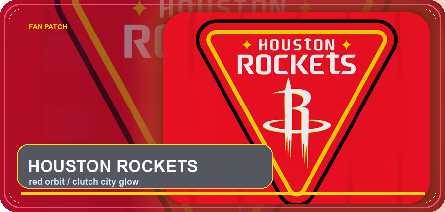

  

  

  
  
  

  

## Profile

 I am Bruce Yang, an undergraduate student at Zhejiang University preparing for graduate study in Computer Science in the United States.

 My current focus is agentic systems, machine learning, and reinforcement learning: how models reason, act, evaluate, and connect with real software workflows. I also work as a full-stack developer, so I care about taking ideas from experiments to usable products.

 Outside code, I follow FC Barcelona, the Houston Rockets , and rap . Good systems, good attacks, and good verses all need rhythm, structure, and timing.

## Identity Board

<table>
  <tr>
    <td align="center" width="50%">
      
    </td>
    <td align="center" width="50%">
      
    </td>
  </tr>
</table>

## Work Surface

<table>
  <tr>
    <td width="33%">
      <strong>Agent Systems</strong> 
      
      
       
      Tool use, workflow orchestration, memory, evaluation, and model-facing product loops.
    </td>
    <td width="33%">
      <strong>ML / RL</strong> 
      
      
       
      Learning algorithms, reinforcement learning, model behavior, and experiment design.
    </td>
    <td width="33%">
      <strong>Product Engineering</strong> 
      
      
       
      Interfaces, APIs, databases, and deployment work that make research usable.
    </td>
  </tr>
</table>

## Stack

  

## GitHub Console

  

  
  
  

  

<table>
  <tr>
    <td width="50%">
      
    </td>
    <td width="50%">
      
    </td>
  </tr>
</table>

  

## Contact

I am always open to research conversations, engineering collaboration, and meeting people who build seriously.

- Email: [1038794832@qq.com](mailto:1038794832@qq.com)
- ZJU email: [3230104703@zju.edu.cn](mailto:3230104703@zju.edu.cn)
- GitHub: [BruceY-rgb](https://github.com/BruceY-rgb)

Visual resources: Capsule Render, Readme Typing SVG, Shields.io, Skill Icons, user-supplied FC Barcelona / Houston Rockets source images, Wikimedia-hosted artist photos, and a Wikimedia-hosted FC Barcelona crest for the glow card. ZJU logotype source: Zhejiang University visual identity resources, with the web-accessible SVG mirrored on the Wikipedia file page.
